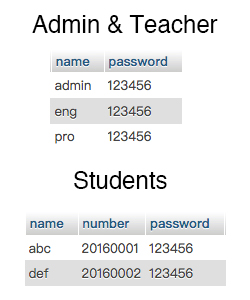

# Information-Manager
This is a website that can be used for student information manager. 
It has one administator, two teachers and many students. 
Admin has authority to add new students, delete students or change one student's information include name, number and password.
Teacher has authority to change one student's score of the subject that the teacher teaches. 
Both admin & teacher can serach student by name and rank the table by default, name, number etc. 
Student can check their scores given by teachers. 
All users can change their passwords without log into the database, but they have to remember their old password to show their identity.
 
In this project, pages "about" & "future" are modified after the apple's website. I do not have the copyright of those pages.
 
You can find the sample website on http://120.78.160.128
 
Accounts are as follows: 

 You can try it yourself, but please make all the changed data back as they were so that others can try it later.
 And if you find any bugs or request any new features, please "Pull requests", thank you.
